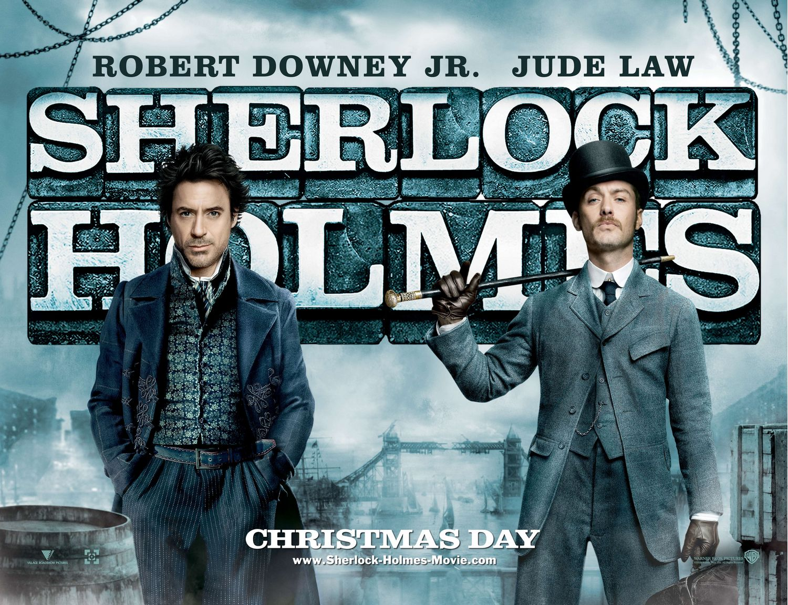

## Sherlock Holmes

Sherlock Holmes y su inseparable socio de investigación el Dr John Watson consiguen evitar a tiempo el ritual de sangre de una joven a manos de Lord Henry Blackwood. Tras arrestar a Blackwood, este recibe la más alta condena que se le puede asignar a un preso: el paso por la horca. Antes de que dé comienzo el juicio, Blackwood pide que Sherlock se pase por su celda para advertirle que su muerte solo será el principio de una nueva era, donde la muerte de tres personas más hará que Londres cambie completamente.

Pronto, Blackwood muere ante los ojos de todos los Lores y su fallecimiento es certificado por el doctor Watson. Sin embargo, la noticia de que Blackwood ha resucitado se hace eco en la sociedad tras encontrar la tumba en la que se hallaba destruida desde dentro, y al sepulturero en estado de shock tras haber visto al asesino caminando entre las tumbas. Sin duda, los acontecimientos que vendrán a continuación escapan a toda lógica posible, creando conmoción en la población. Solo Sherlock Holmes puede desenmascarar la verdad del caso y demostrar que todas las acciones aparentemente sobrenaturales tienen una explicación científica.