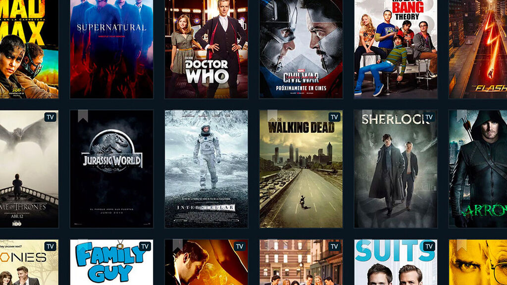

## Película

Una película (del latín pellicula, diminutivo de pellis, «piel») es una serie de imágenes fijas que, cuando se proyectan en una pantalla de forma consecutiva en rápida sucesión, crean la ilusión óptica de imágenes en movimiento. El término normalmente se usa como sinónimo de obra cinematográfica,1​ es decir, una historia (ficticia o documental), registrada en un soporte (película flexible o contenedor digital) que se graba y lee mediante un mecanismo continuo o intermitente de sucesión de imágenes. Estas películas cinematográficas también reciben el nombre de film2​ o filme, así como la abreviatura peli.

El proceso de rodaje. Una película se puede crear fotografiando escenas reales con una cámara de imágenes en movimiento, fotografiando dibujos o modelos en miniatura utilizando técnicas de animación tradicional, por medio de imágenes generada por computadora o animación por computadora, o por una combinación de algunas o todas estas técnicas y otros efectos visuales.

Las películas se grababan originalmente en una película de plástico a través de un proceso fotoquímico y luego se mostraban a través de un proyector de películas en una pantalla grande. Las películas contemporáneas ahora a menudo son completamente digitales a lo largo de todo el proceso de producción, distribución y exhibición. Las películas grabadas en forma fotoquímica tradicionalmente incluían una banda sonora óptica análoga (una grabación gráfica de las palabras habladas, música y otros sonidos, que acompañan a las imágenes y que van a lo largo de una parte de la película reservada exclusivamente para ello, que no se proyecta).