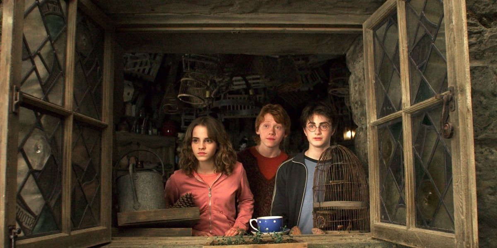

## Harry Potter - El Prisionero de Azkaban

Cuando Harry Potter y sus amigos vuelven a Hogwarts para cursar su tercer año de estudios, se ven involucrados en un misterio: de la prisión para magos de Azkaban se ha fugado Sirius Black, un peligroso mago que fue cómplice de Lord Voldemort y que intentará vengarse de Harry Potter. El joven aprendiz de mago contribuyó en gran medida a la condena de Sirius, por lo que hay razones para temer por su vida.